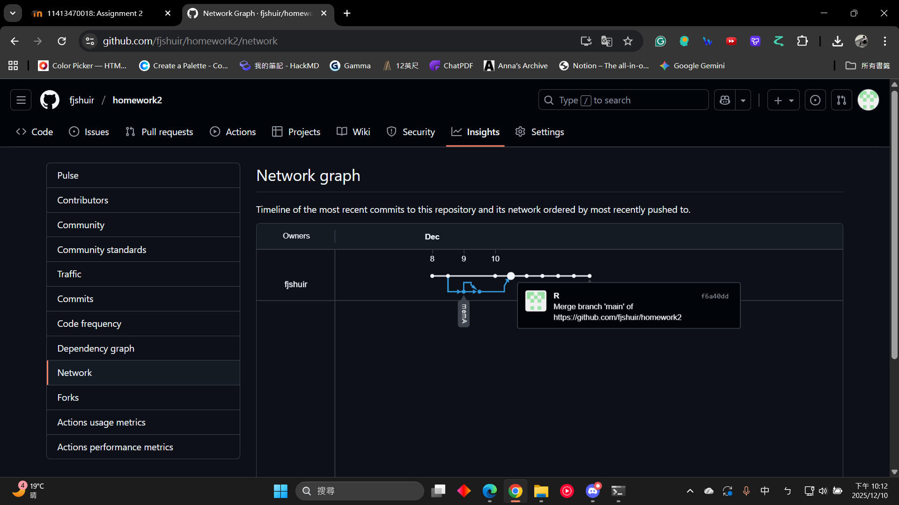

# 💰 個人記帳與支出分析系統
這是一個基於 Python 開發的個人記帳程式，可以記錄您的日常收支，並自動生成圓餅圖，視覺化分析您的支出比例。

## 🛠️ 環境設定與安裝
本專案需要 **Python 3.6 或更高版本**。

### 依賴套件
請確保您的環境中已安裝下列必要的 Python 套件。您可以使用 `pip` 執行以下指令進行安裝：
```bash
pip install matplotlib
```

運行主程式 `Accounting.py`，程式會提示您輸入收支細節。輸入完並儲存便可執行`chart_generator.py`生成圖表

#### 結果呈現
two branches merged together. 


圓餅圖
